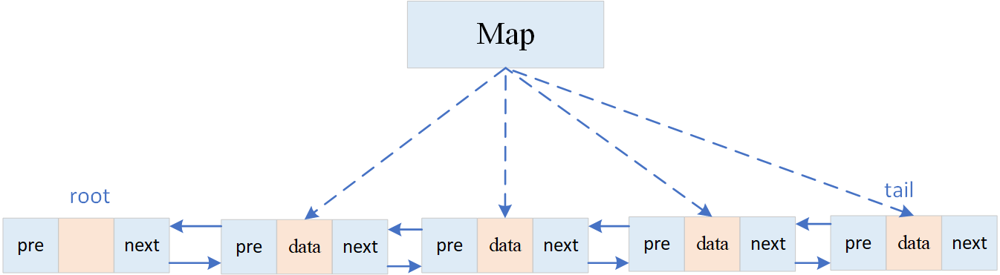

# 1、整体架构

每个缓存节点，均可暴露http接口，以接受用户的查询请求，此外，每个缓存节点，均保存了其它节点的ip地址，以及真实节点与hash环中虚拟节点的映射关系，可以找到对应的key应该在哪个节点进行查询，并与该节点进行通信。

用户携带key发送查询请求进来后的流程如下：
1. 在当前节点进行查询，若当前节点存在key对应的value，则直接将结果返回给用户；
2. 当前节点不存在key对应的值，则使用一致性hash算法，找到key值对应的虚拟节点，通过map中存储的映射关系找到真实节点，去真实节点中进行查询。
3. 若缓存中存在key，则将查询结果返回；
4. 缓存中不存在key，则使用设置的回调函数，去数据库进行查询，并将查询结果返回，并将查询到的key-value队存入数据库。
   
# 2、一致性hash算法
目前默认3个真实节点对应哈希环中50倍的虚拟节点（150个），也就是说1个真实节点对应hash环中50个虚拟节点，虚拟节点按照真实节点的url+序号通过crc32.ChecksumIEEEhash算法，随机的对应2^32个hash环中槽的一个位置。保证了相同的key每次都能对应同一个节点的同时，防止了hash环倾斜的问题。
但是目前的服务是在启动时，就确定了节点的数量和通信ip，不支持动态的扩容和删除节点，这是未来可以改良的部分。

# 3、LRU淘汰机制
使用带头结点的双向链表存储数据，使用map存储了每个key对应的结点，保证了查找的O(1)复杂度。
+ 淘汰数据：从尾结点开始删除结点。
+ 插入数据：数据插入在root后面；
+ 已经在缓存中的数据被查询后：移至root后；



# 4、屏障锁机制
为了防止某个key短期内大量查询，导致缓存穿透，使用屏障锁，使得短期内相同key的查询只通过一个（这个短期的时间有多长？取决于当前状态的底层数据库，响应该key的请求时间）；锁屏障原理如下：
1. key查询请求过来时，申请锁，获得锁的请求将继续下去，其它请求阻塞在该位置；
2. 判断要查找的key是否已经存在设置的map中，存在则进入map中的逻辑，不存在则继续向下去读取数据，（第一次进来map中肯定未存储key），若存在则等待设置的信号量锁；
3. 实例化一个值的结构体，将其存入map中，以查询的key为键，此时添加信号量锁，在释放读写锁；（此时1中等待的请求将全部进入2中，等待信号量锁的释放）；
4. 读取数据，存入实例化好的结构体中，释放信号量锁，此时2中所有请求将时间读取存储在map中的数据；
5. 最后情况map中键值对。

# 5、protobuf
1. 创建.ptoto文件，定义请求和响应参数，使用protoc生成go文件;
2. 将请求和响应改为生成go文件的结构体；
3. 使用proto序列号与反序列化请求和响应数据即可。


# 6、运行

1. 拉取到本地

   ```git
   git clone https://github.com/2563347014/DistributedCache.git
   ```

2. 切换目录

   ```git
   cd ./DistributedCache
   ```

3. 授予运行权限

   ```git
   chmod 777 ./start.sh
   ```

4. 启动服务

   ```shell
   ./start.sh
   ```


# 7、测试

默认开启的端口是9999，使用Get格式传输查询的key值。

```shell
curl "http://localhost:9999/api?key=Tom"
```
