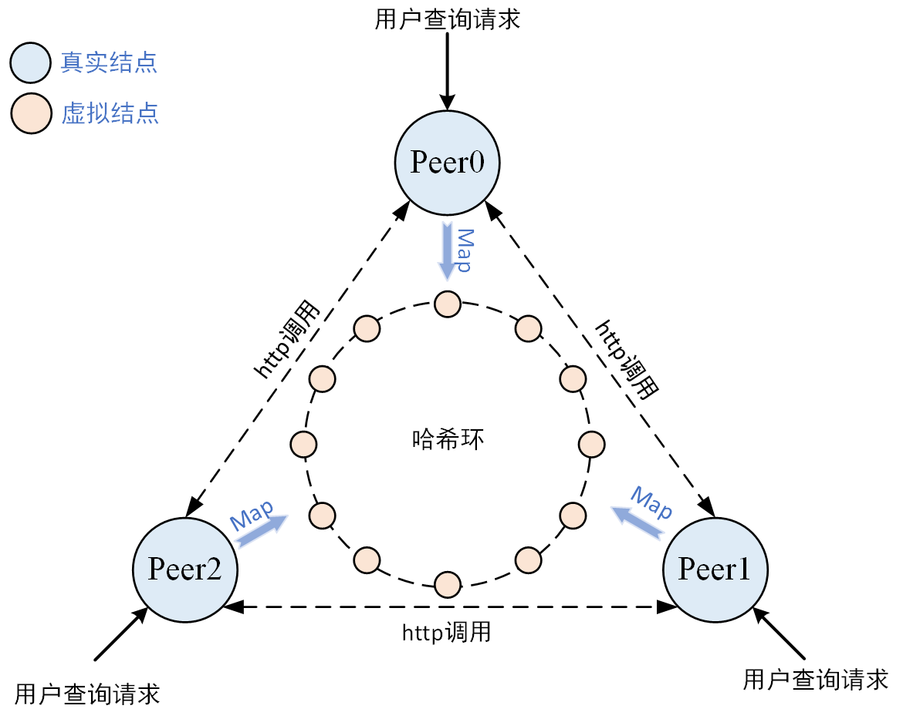

# 1、简要概述

这是go语言实现的分布式缓存系统，以键值对的形式存储数据，一致性hash算法选择存储节点，Protobuf通信协议编解码。用户输入查询请求后，会优先在缓存系统查询，查不到则使用回调函数去源数据库查询，再将查询结果存入缓存系统并返回给用户。框架如下：



# 2、运行

1. 拉取到本地

   ```git
   git clone https://github.com/2563347014/DistributedCache.git
   ```

2. 切换目录

   ```git
   cd ./DistributedCache
   ```

3. 授予运行权限

   ```git
   chmod 777 ./start.sh
   ```

4. 启动服务

   ```shell
   ./start.sh
   ```


# 3、测试

默认开启的端口是9999，使用Get格式传输查询的key值。

```shell
curl "http://localhost:9999/api?key=Tom"
```
